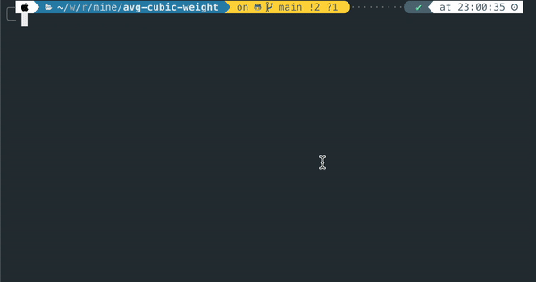

# Average Cubic Weight
This command line application takes one argument as string and output the average cubic weight of all air conditioners.

## Running the application
Step 1: Install dependencies
```
npm install
```
Step 2: Run with input
```
npm start <input string>
```
(See example below)
</hr>


## Running the tests
```
npm test
```